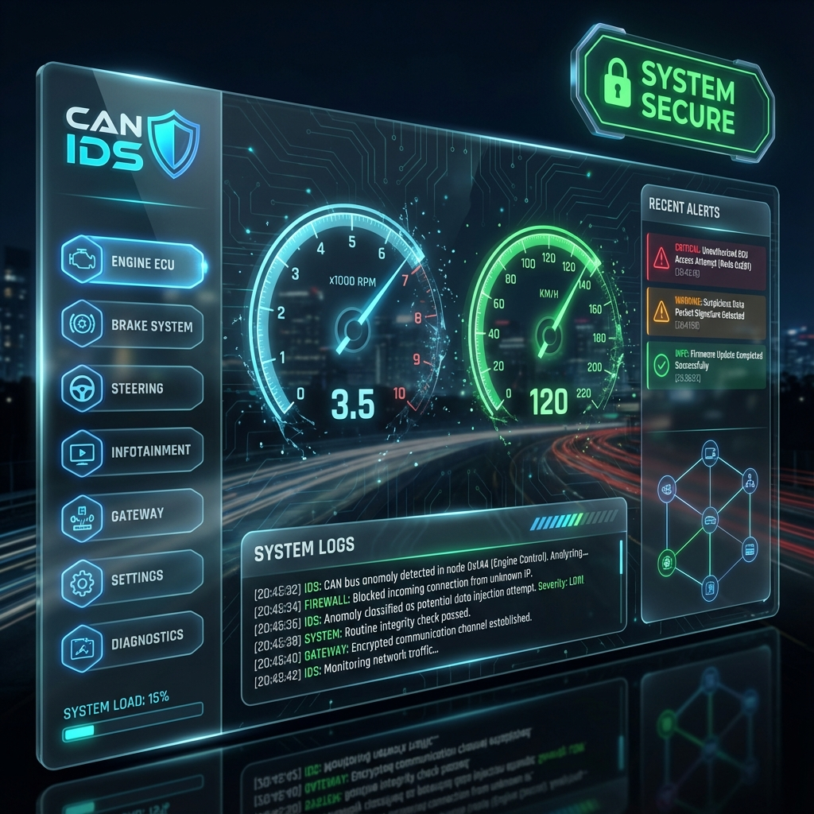

# CAN Bus Intrusion Detection System (IDS) Framework

A real-time Intrusion Detection System for Automotive CAN Networks using **Hybrid Machine Learning** (Autoencoder + One-Class SVM) and a modern **React Dashboard**.



## 🚗 Project Overview

Modern vehicles are "computers on wheels," but their internal network (CAN Bus) was designed in the 1980s without security. This project demonstrates a complete end-to-end solution to detect cyberattacks on vehicles.

It consists of three main components:
1.  **Vehicle Simulator**: Generates realistic physics-based CAN traffic (RPM, Speed, Gear).
2.  **IDS Engine**: A hybrid ML model that detects anomalies in real-time.
3.  **Web Dashboard**: A "Glass Cockpit" interface for monitoring and control.

## ✨ Features

*   **Real-Time Simulation**: Simulates a vehicle accelerating, shifting gears, and braking.
*   **Hybrid Detection**:
    *   **Autoencoder**: Detects context/logic attacks (e.g., High RPM vs. Low Speed).
    *   **One-Class SVM**: Detects statistical anomalies (e.g., DoS/Flooding).
*   **Attack Injection**:
    *   **Spoofing**: Injecting fake gear signals.
    *   **Replay**: Replaying recorded traffic.
    *   **DoS (Flooding)**: Jamming the bus with high-priority messages.
*   **Interactive Dashboard**:
    *   Live Gauges (Tachometer, Speedometer).
    *   Real-time Alert Feed.
    *   System Logs with "Bus Off" detection.

## 🛠️ Tech Stack

*   **Backend**: Python 3.8+, FastAPI, WebSockets
*   **Frontend**: React.js, Vite, Recharts, Lucide Icons
*   **Machine Learning**: TensorFlow (Keras), Scikit-learn
*   **CAN Interface**: `python-can`, `socketcan` (vcan0)
*   **OS**: Linux / WSL2 (Ubuntu)

## 🚀 Installation & Setup

### Prerequisites
*   Linux or WSL2 (Windows Subsystem for Linux)
*   Python 3.8+
*   Node.js 16+

### 1. Clone the Repository
```bash
git clone https://github.com/YOUR_USERNAME/can-ids-framework.git
cd can-ids-framework
```

### 2. Setup Virtual CAN Interface
Run the helper script to create the `vcan0` interface:
```bash
sudo ./run_system.sh
```
*Or manually:*
```bash
sudo modprobe vcan
sudo ip link add dev vcan0 type vcan
sudo ip link set up vcan0
```

### 3. Backend Setup
```bash
# Create virtual environment
python3 -m venv venv
source venv/bin/activate

# Install dependencies
pip install -r requirements.txt
```

### 4. Frontend Setup
```bash
cd frontend
npm install
```

## 🖥️ Usage

### 1. Start the Backend Server
From the root directory:
```bash
uvicorn backend.main:app --reload --host 0.0.0.0 --port 8000
```

### 2. Start the Frontend
In a new terminal (inside `frontend/`):
```bash
npm run dev
```
Open your browser at `http://localhost:5173`.

### 3. Run the Demo
1.  Click **Start Sim** on the dashboard. You should see the gauges move.
2.  Click **Enable IDS** to start the detection engine.
3.  Try clicking **Spoof Attack** or **Flood Attack** to see the IDS in action!

## 🛡️ Attack Scenarios

| Attack | Description | Detection Method |
| :--- | :--- | :--- |
| **Spoofing** | Injecting "Gear 2" while cruising in "Gear 5". | **Autoencoder** (Context Mismatch) |
| **Replay** | Replaying a recorded "Unlock" signal. | **One-Class SVM** (Timing/IAT Anomaly) |
| **DoS** | Flooding the bus with ID `0x000`. | **One-Class SVM** (Frequency Spike) |

## 📄 License

This project is licensed under the MIT License - see the [LICENSE](LICENSE) file for details.
