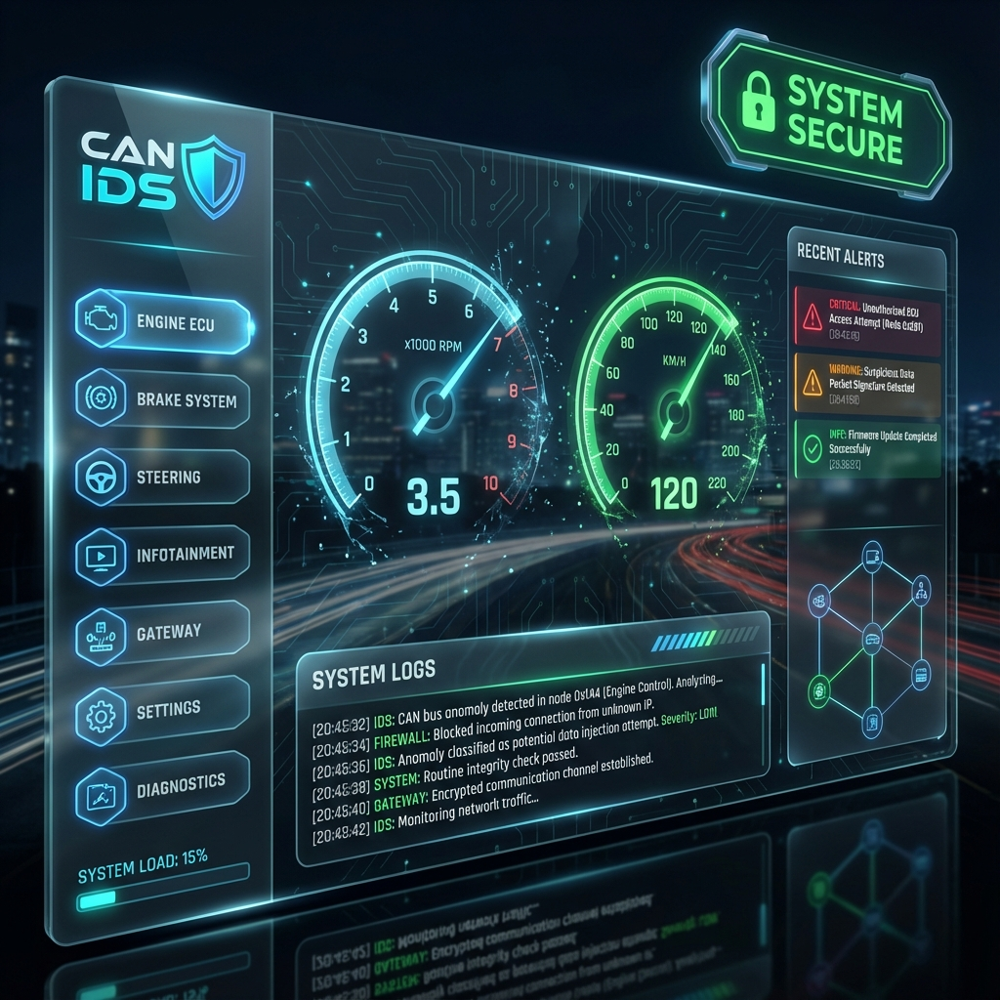

# 🛡️ CAN Bus Intrusion Detection System (IDS)

A real-time **Intrusion Detection System** for Automotive CAN Networks using **Hybrid Machine Learning** (Autoencoder + One-Class SVM), featuring an animated **Cyberpunk Glass Cockpit Dashboard**.



## 🚗 Project Overview

Modern vehicles rely on the **CAN Bus** protocol — designed in the 1980s with **zero built-in security**. This project demonstrates a complete end-to-end solution to detect cyberattacks on in-vehicle networks in real-time.

### System Architecture
```
┌──────────────┐     vcan0      ┌──────────────┐    WebSocket    ┌──────────────┐
│   Vehicle    │ ──────────────▶│   IDS Engine  │ ──────────────▶│    React     │
│  Simulator   │   CAN Frames   │  (ML Models)  │   Live Data    │  Dashboard   │
└──────────────┘                └──────────────┘                └──────────────┘
       │                               │
       │  CAN IDs:                     │  Detection:
       │  0x123 = RPM                  │  Autoencoder (Context)
       │  0x310 = Gear                 │  One-Class SVM (Stats)
       │  0x240 = Brake                │
       │                               │
┌──────────────┐                       │
│   Attack     │ ──────────────────────┘
│  Simulators  │   0x000 = Flood (DoS)
└──────────────┘   0x310 = Spoof
```

## ✨ Features

- **🎯 Hybrid ML Detection**: Autoencoder for context-aware attacks + One-Class SVM for statistical anomalies
- **🚀 Real-Time Dashboard**: Animated HUD-style gauges with glowing neon arcs, spring-physics needles, and progressive tick illumination
- **⚡ Attack Simulation**: Spoofing, Replay, and DoS (Flood) attack injection from the dashboard
- **🖥️ Glassmorphism UI**: Cyberpunk-themed interface with frosted glass panels, neon accents, and grid backdrop
- **📊 Live Monitoring**: WebSocket-powered real-time CAN data, IDS alerts, and system logs
- **🔴 DoS Detection**: Automatic "Bus Off" state detection with visual indicators

## 🛠️ Tech Stack

| Layer | Technology |
|---|---|
| **Backend** | Python 3.8+, FastAPI, WebSockets |
| **Frontend** | React.js, Vite, HTML5 Canvas, Lucide Icons |
| **Machine Learning** | TensorFlow (Keras Autoencoder), Scikit-learn (One-Class SVM) |
| **CAN Interface** | `python-can`, `socketcan`, Virtual CAN (`vcan0`) |
| **OS** | Linux / WSL2 (Ubuntu) |

## 🚀 Quick Start

### Prerequisites
- Linux or WSL2 (Windows Subsystem for Linux)
- Python 3.8+
- Node.js 16+

### 1. Clone & Setup CAN
```bash
git clone https://github.com/Shrihari-I-B/automotive-can-bus-ml-ids-guardian.git
cd automotive-can-bus-ml-ids-guardian

# Setup Virtual CAN interface
sudo modprobe vcan
sudo ip link add dev vcan0 type vcan
sudo ip link set up vcan0
```

### 2. Backend
```bash
pip install -r requirements.txt
uvicorn backend.main:app --reload --host 0.0.0.0 --port 8000
```

### 3. Frontend (new terminal)
```bash
cd frontend
npm install
npm run dev
```

Open **http://localhost:5173** in your browser.

### 4. Run the Demo
1. Click **Start Sim** → Watch the gauges animate as the vehicle accelerates
2. Click **Enable IDS** → Activate the ML detection engine
3. Click **Spoof Attack** or **Flood Attack** → See intrusions detected in real-time!

## 🛡️ Attack Scenarios

| Attack | What It Does | CAN ID | Detection |
|---|---|---|---|
| **Spoofing** | Injects fake "Gear 2" while cruising in Gear 5 | `0x310` | **Autoencoder** (Context Mismatch) |
| **Replay** | Replays recorded CAN traffic | Various | **One-Class SVM** (Timing Anomaly) |
| **DoS Flood** | Jams the bus with highest-priority ID | `0x000` | **One-Class SVM** (Frequency Spike) |

## � Project Structure
```
can_ids_framework/
├── backend/                 # FastAPI server
│   ├── main.py              # WebSocket + API endpoints
│   ├── process_manager.py   # Script lifecycle manager
│   ├── log_parser.py        # IDS log parsing + DoS detection
│   └── routers/control.py   # REST API for start/stop/attack
├── frontend/                # React dashboard
│   ├── src/App.jsx          # Main dashboard layout
│   └── src/components/      # Tachometer, Speedometer (Canvas)
├── can_ids/                 # Core ML + simulation
│   ├── models/              # Trained Autoencoder + SVM models
│   ├── attacks/             # Attack scripts (flood, spoof)
│   └── main_live_ids.py     # Real-time IDS detection engine
└── run_simulation_v2.py     # Vehicle physics simulator
```

## 📄 License

MIT License — see [LICENSE](LICENSE) for details.
